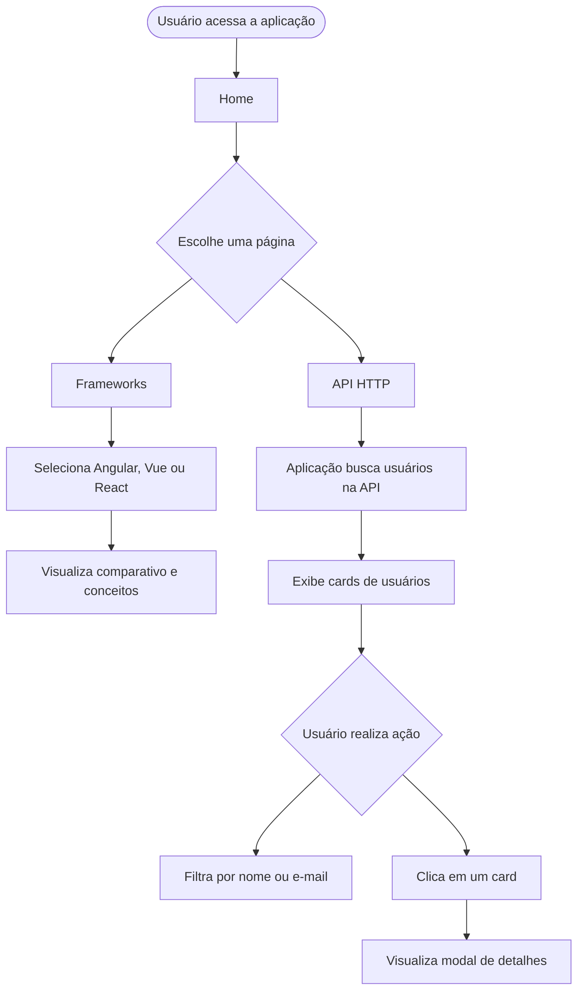
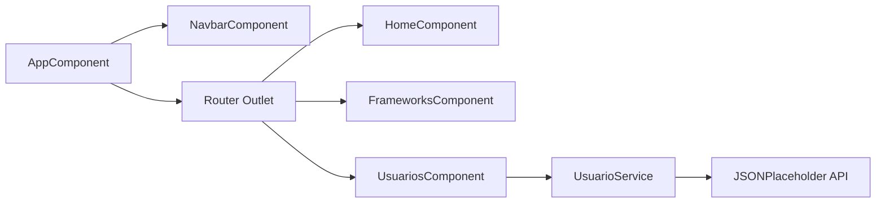

# ⚡ Frontend Tópicos — Desenvolvimento Front-End com Angular

> Aplicação web desenvolvida em **Angular 17** como trabalho prático da disciplina de  
> **Programação Front-End** do curso de **Análise e Desenvolvimento de Sistemas**.

O projeto apresenta conceitos fundamentais do desenvolvimento front-end moderno, com foco em **Angular**, comparação entre frameworks, navegação em SPA, consumo de API REST e testes unitários.

---

## 📋 Índice

- [Sobre o Projeto](#-sobre-o-projeto)
- [Objetivos](#-objetivos)
- [Funcionalidades](#-funcionalidades)
- [Demonstração](#-demonstração)
- [Arquitetura do Projeto](#-arquitetura-do-projeto)
- [Tecnologias Utilizadas](#-tecnologias-utilizadas)
- [Requisitos](#-requisitos)
- [Instalação](#-instalação)
- [Como Executar](#-como-executar)
- [Como Utilizar](#-como-utilizar)
- [API Utilizada](#-api-utilizada)
- [Testes](#-testes)
- [Deploy](#-deploy)
- [Equipe](#-equipe)
- [Licença](#-licença)

---

## 🔭 Sobre o Projeto

O **Frontend Tópicos** é uma **Single Page Application (SPA)** desenvolvida com Angular. A aplicação foi criada para apresentar, de forma visual e interativa, conteúdos relacionados ao desenvolvimento front-end.

O sistema possui três páginas principais:

- **Home**: apresenta o objetivo do projeto e os tópicos abordados.
- **Frameworks**: compara Angular, Vue.js e React.
- **API HTTP**: consome uma API pública e exibe usuários em cards interativos.

O projeto tem finalidade acadêmica e busca demonstrar, na prática, conceitos estudados na disciplina, como componentização, rotas, requisições HTTP, responsividade e testes.

---

## 🎯 Objetivos

- Desenvolver uma aplicação front-end utilizando Angular.
- Utilizar **Angular Router** para navegação entre páginas.
- Criar componentes standalone.
- Consumir dados de uma API REST pública com **HttpClient**.
- Trabalhar com tipagem usando TypeScript.
- Aplicar CSS para construção de uma interface responsiva.
- Demonstrar testes unitários com **Karma** e **Jasmine**.
- Comparar Angular com outros frameworks populares do mercado.

---

## ✅ Funcionalidades

- Navegação entre páginas sem recarregar o navegador.
- Menu responsivo com abertura e fechamento em telas menores.
- Página inicial com apresentação dos tópicos do trabalho.
- Comparativo interativo entre **Angular**, **Vue.js** e **React**.
- Exibição de pontos fortes, pontos fracos e casos de uso de cada framework.
- Seção com conceitos fundamentais do Angular e exemplos de código.
- Consumo da API pública **JSONPlaceholder**.
- Listagem de usuários obtidos via requisição HTTP.
- Busca de usuários por nome ou e-mail.
- Modal de detalhes ao clicar em um usuário.
- Tratamento de carregamento e erro na requisição da API.
- Testes unitários para componentes e service.

> Observação: a aplicação **não possui cadastro, edição ou remoção de usuários**. Os dados são apenas consultados da API pública e exibidos na interface.

---

## 🎬 Demonstração

### Site publicado

A aplicação está publicada no GitHub Pages:

```text
https://hosoyiri.github.io/Trabalho-Flores-2B/
```

### Fluxo de uso



---

## 🏗️ Arquitetura do Projeto

A aplicação utiliza a estrutura padrão de um projeto Angular com componentes standalone.



### Organização das pastas

```text
Trabalho-Flores-2B/
├── src/
│   ├── app/
│   │   ├── components/
│   │   │   └── navbar/
│   │   │       ├── navbar.component.ts
│   │   │       ├── navbar.component.html
│   │   │       ├── navbar.component.css
│   │   │       └── navbar.component.spec.ts
│   │   │
│   │   ├── pages/
│   │   │   ├── home/
│   │   │   │   ├── home.component.ts
│   │   │   │   ├── home.component.html
│   │   │   │   ├── home.component.css
│   │   │   │   └── home.component.spec.ts
│   │   │   │
│   │   │   ├── frameworks/
│   │   │   │   ├── frameworks.component.ts
│   │   │   │   ├── frameworks.component.html
│   │   │   │   ├── frameworks.component.css
│   │   │   │   └── frameworks.component.spec.ts
│   │   │   │
│   │   │   └── usuarios/
│   │   │       ├── usuarios.component.ts
│   │   │       ├── usuarios.component.html
│   │   │       ├── usuarios.component.css
│   │   │       └── usuarios.component.spec.ts
│   │   │
│   │   ├── services/
│   │   │   ├── usuario.service.ts
│   │   │   └── usuario.service.spec.ts
│   │   │
│   │   ├── models/
│   │   │   └── usuario.model.ts
│   │   │
│   │   ├── app.component.ts
│   │   ├── app.component.html
│   │   ├── app.component.css
│   │   ├── app.component.spec.ts
│   │   ├── app.config.ts
│   │   └── app.routes.ts
│   │
│   ├── assets/
│   ├── index.html
│   ├── main.ts
│   └── styles.css
│
├── angular.json
├── package.json
├── package-lock.json
├── tsconfig.json
├── tsconfig.app.json
├── tsconfig.spec.json
└── README.md
```

### Responsabilidade dos principais módulos

| Módulo | Responsabilidade |
|---|---|
| `AppComponent` | Componente raiz da aplicação. |
| `NavbarComponent` | Menu de navegação responsivo. |
| `HomeComponent` | Página inicial com apresentação do trabalho. |
| `FrameworksComponent` | Página de comparação entre Angular, Vue.js e React. |
| `UsuariosComponent` | Página que consome e exibe dados da API. |
| `UsuarioService` | Service responsável pelas requisições HTTP. |
| `Usuario` | Interface TypeScript que define o formato dos dados de usuário. |
| `app.routes.ts` | Arquivo responsável pela configuração das rotas. |
| `app.config.ts` | Configuração dos providers da aplicação, incluindo Router e HttpClient. |

---

## 🛠️ Tecnologias Utilizadas

| Tecnologia | Versão / Uso |
|---|---|
| Angular | 17.3.x |
| TypeScript | 5.4.x |
| HTML5 | Estrutura dos templates |
| CSS3 | Estilização e responsividade |
| Angular Router | Navegação entre páginas |
| Angular HttpClient | Requisições HTTP |
| RxJS | Manipulação de Observables |
| Jasmine | Escrita dos testes unitários |
| Karma | Execução dos testes |
| GitHub Pages | Publicação da aplicação |

---

## 📋 Requisitos

Para executar o projeto localmente, é necessário ter instalado:

- Node.js
- npm
- Angular CLI
- Git

Versões utilizadas no projeto:

| Dependência | Versão aproximada |
|---|---|
| Angular CLI | 17.3.x |
| Angular | 17.3.x |
| TypeScript | 5.4.x |
| RxJS | 7.8.x |
| Karma | 6.4.x |
| Jasmine | 5.1.x |

---

## 🚀 Instalação

Clone o repositório:

```bash
git clone https://github.com/Hosoyiri/Trabalho-Flores-2B.git
```

Acesse a pasta do projeto:

```bash
cd Trabalho-Flores-2B
```

Instale as dependências:

```bash
npm install
```

---

## ▶️ Como Executar

Execute o servidor de desenvolvimento:

```bash
ng serve
```

Depois, acesse no navegador:

```text
http://localhost:4200
```

Também é possível executar com o script do npm:

```bash
npm start
```

---

## 📖 Como Utilizar

### Página Home

A página inicial apresenta:

- título do projeto;
- descrição dos tópicos abordados;
- cards explicativos sobre Angular, Vue.js, React, Componentes, HTTP Client e testes;
- botões de navegação para as páginas de frameworks e API HTTP.

### Página Frameworks

A página de frameworks permite comparar:

- Angular;
- Vue.js;
- React.

Para cada tecnologia, são exibidos:

- criador;
- ano de lançamento;
- linguagem utilizada;
- descrição;
- pontos fortes;
- pontos fracos;
- casos de uso.

A página também apresenta uma tabela comparativa e exemplos de conceitos do Angular, como componentes, data binding, HTTP Client, rotas, injeção de dependência e testes.

### Página API HTTP

A página de usuários demonstra o consumo de uma API REST usando Angular HttpClient.

Funcionalidades disponíveis:

- carregar usuários da API JSONPlaceholder;
- exibir usuários em cards;
- buscar usuários por nome ou e-mail;
- selecionar um usuário para abrir um modal de detalhes;
- exibir mensagens de carregamento e erro.

---

## 🌐 API Utilizada

O projeto utiliza a API pública **JSONPlaceholder**, que disponibiliza dados fictícios para testes e prototipação.

### Base URL

```text
https://jsonplaceholder.typicode.com
```

### Endpoints utilizados

| Método | Endpoint | Descrição |
|---|---|---|
| `GET` | `/users` | Retorna a lista de usuários. |
| `GET` | `/users/:id` | Retorna um usuário específico por ID. |

### Exemplo de requisição no service

```typescript
getUsuarios(): Observable<Usuario[]> {
  return this.http.get<Usuario[]>(this.apiUrl);
}

getUsuarioPorId(id: number): Observable<Usuario> {
  return this.http.get<Usuario>(`${this.apiUrl}/${id}`);
}
```

### Modelo de usuário

```typescript
export interface Usuario {
  id: number;
  name: string;
  email: string;
  phone: string;
  website: string;
}
```

> A aplicação apenas consulta os dados da API. Não há persistência em banco de dados nem armazenamento local com `localStorage`.

---

## 🧪 Testes

O projeto possui testes unitários com **Jasmine** e **Karma**.

Para executar:

```bash
ng test
```

ou:

```bash
npm test
```

### Arquivos de teste

| Arquivo | O que testa |
|---|---|
| `app.component.spec.ts` | Criação do componente principal. |
| `navbar.component.spec.ts` | Criação do menu e abertura/fechamento do menu responsivo. |
| `home.component.spec.ts` | Criação da página inicial, título e quantidade de tópicos. |
| `frameworks.component.spec.ts` | Criação do componente, quantidade de frameworks e troca de framework ativo. |
| `usuarios.component.spec.ts` | Carregamento de usuários, filtro e seleção de usuário. |
| `usuario.service.spec.ts` | Requisições HTTP para listar usuários e buscar usuário por ID. |

### Estratégias usadas

| Estratégia | Uso |
|---|---|
| `jasmine.SpyObj` | Criação de mock do `UsuarioService` nos testes da página de usuários. |
| `HttpTestingController` | Interceptação de chamadas HTTP nos testes do service. |
| `RouterTestingModule` | Simulação de rotas em testes de componentes. |
| `of()` do RxJS | Retorno de Observables simulados nos testes. |

---

## 🚢 Deploy

O projeto foi publicado no **GitHub Pages**.

URL da aplicação:

```text
https://hosoyiri.github.io/Trabalho-Flores-2B/
```

Para gerar uma versão de produção localmente:

```bash
ng build
```

Os arquivos de build são gerados na pasta `dist/`.

---

## 🔒 Observações sobre Segurança

- O projeto não utiliza autenticação.
- Não há uso de senhas, tokens ou chaves de API.
- Os dados exibidos vêm de uma API pública de testes.
- Não há backend próprio nem banco de dados.
- O projeto tem finalidade acadêmica e demonstrativa.

---

## 🗺️ Melhorias Futuras

Possíveis melhorias para versões futuras:

- Implementar CRUD completo de usuários.
- Criar backend próprio.
- Adicionar persistência em banco de dados.
- Implementar paginação.
- Adicionar tela de login.
- Melhorar acessibilidade.
- Adicionar tema escuro.
- Expandir a cobertura de testes.
- Criar documentação visual com prints da aplicação.

---

## 👥 Equipe

| Nome | RA |
|---|---|
| Nome do integrante 1 | RA |
| Nome do integrante 2 | RA |
| Nome do integrante 3 | RA |
| Nome do integrante 4 | RA |
| Nome do integrante 5 | RA |

**Instituição:** UniCesumar  
**Curso:** Análise e Desenvolvimento de Sistemas  
**Disciplina:** Programação Front-End  
**Professor:** José Carlos Domingues Flores  
**Semestre:** 2025  

---

## 📄 Licença

Este projeto foi desenvolvido exclusivamente para fins acadêmicos.

Não há licença open-source aplicada formalmente. O uso, cópia ou distribuição do código deve ser feito com autorização dos autores e da instituição de ensino.

---

<div align="center">

Desenvolvido com ❤️ por estudantes de ADS — UniCesumar

</div>
