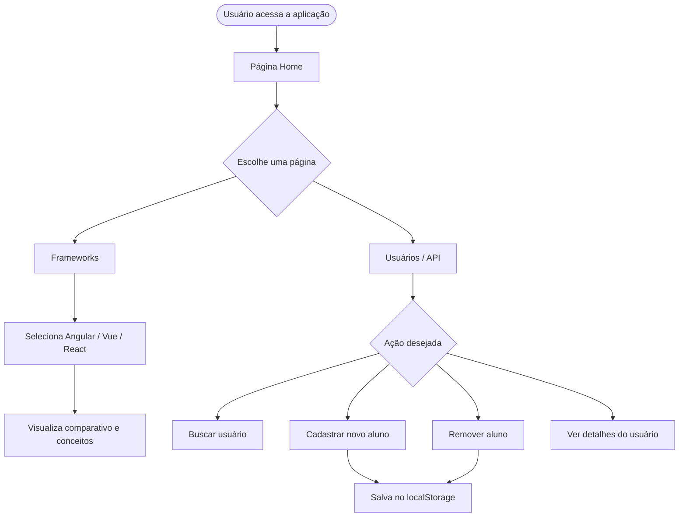
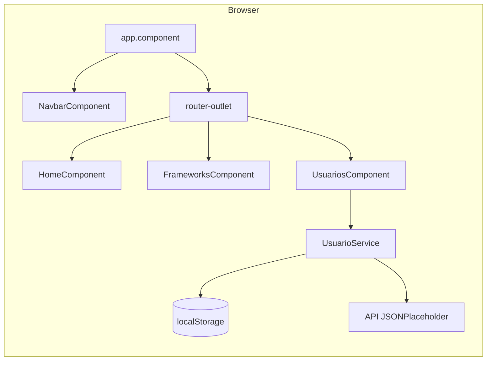
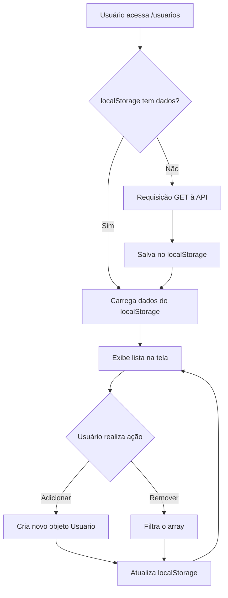

```markdown  
# ⚡ Frontend Tópicos — Tópicos em Desenvolvimento de Front-End

> Aplicação web desenvolvida em **Angular 17** como trabalho prático da disciplina de  
> **Programação Front-End** do curso de **Análise e Desenvolvimento de Sistemas**.  
> O projeto explora os principais frameworks front-end do mercado, conceitos fundamentais  
> do Angular e boas práticas de desenvolvimento web moderno.

---

## 📋 Índice

- [Visão Geral](#-visão-geral)  
- [Demonstração](#-demonstração)  
- [Arquitetura do Projeto](#-arquitetura-do-projeto)  
- [Tecnologias Utilizadas](#-tecnologias-utilizadas)  
- [Requisitos](#-requisitos)  
- [Instalação](#-instalação)  
- [Como Executar](#-como-executar)  
- [Como Utilizar](#-como-utilizar)  
- [API Utilizada](#-api-utilizada)  
- [Persistência de Dados](#-persistência-de-dados)  
- [Testes](#-testes)  
- [Segurança](#-segurança)  
- [Guia para Desenvolvedores](#-guia-para-desenvolvedores)  
- [Contribuição](#-contribuição)  
- [Roadmap](#-roadmap)  
- [FAQ](#-faq)  
- [Equipe](#-equipe)  
- [Licença](#-licença)

---

## 🔭 Visão Geral

### O que o sistema faz

O **Frontend Tópicos** é uma **Single Page Application (SPA)** construída com Angular  
que apresenta, de forma interativa e visual, os principais tópicos do desenvolvimento  
front-end moderno. A aplicação possui três páginas navegáveis sem recarregamento do  
navegador, consumo de API REST pública e gerenciamento local de dados com `localStorage`.

### Problema que resolve

Estudantes de desenvolvimento de software frequentemente têm dificuldade em compreender  
as diferenças entre os frameworks front-end do mercado e como o Angular funciona na  
prática. Este projeto centraliza esses conceitos em uma aplicação funcional, didática e  
interativa, unindo teoria e prática em um único lugar.

### Público-alvo

| Perfil | Descrição |  
|---|---|  
| Estudantes de ADS | Compreender frameworks front-end na prática |  
| Professores | Referência didática de projeto Angular completo |  
| Desenvolvedores iniciantes | Exemplo de estrutura Angular com boas práticas |

### Principais funcionalidades

- ✅ Navegação entre páginas via **Angular Router** sem recarregamento  
- ✅ Comparativo interativo entre **Angular**, **Vue.js** e **React**  
- ✅ Conceitos do Angular com exemplos de código em tempo real  
- ✅ Consumo de **API REST pública** com `HttpClient`  
- ✅ **Cadastro de alunos** com persistência via `localStorage`  
- ✅ **Remoção de alunos** com confirmação  
- ✅ **Busca em tempo real** por nome e e-mail  
- ✅ Modal de detalhes ao clicar em um card  
- ✅ Layout totalmente **responsivo** para mobile e desktop  
- ✅ Testes unitários com **Karma** e **Jasmine**

---

## 🎬 Demonstração

### Fluxo de uso



### Exemplos práticos

#### Cadastrando um aluno

1\. Acesse a página **Usuários / API**  
2\. Preencha o formulário:

```  
Nome:     João Silva  
E-mail:   joao@email.com  
Telefone: (44) 99999-9999  
Website:  github.com/joaosilva  
```

3\. Clique em **Adicionar aluno**  
4\. O aluno aparece no topo da lista com ID gerado automaticamente

#### Removendo um aluno

1\. Localize o card do aluno na lista  
2\. Clique no ícone 🗑️ no canto superior esquerdo do card  
3\. Confirme a remoção na janela de diálogo  
4\. O aluno é removido da lista e do `localStorage`

#### Buscando usuários

1\. Digite o nome ou e-mail no campo de busca  
2\. A lista é filtrada em tempo real sem nenhum clique adicional

---

## 🏗️ Arquitetura do Projeto

### Fluxo geral da aplicação



### Organização das pastas

```  
frontend-topicos/  
├── src/  
│   ├── app/  
│   │   ├── components/  
│   │   │   └── navbar/  
│   │   │       ├── navbar.component.ts        # Lógica do menu de navegação  
│   │   │       ├── navbar.component.html      # Template do menu  
│   │   │       ├── navbar.component.css       # Estilos do menu  
│   │   │       └── navbar.component.spec.ts   # Testes unitários do menu  
│   │   │  
│   │   ├── pages/  
│   │   │   ├── home/  
│   │   │   │   ├── home.component.ts          # Lógica da página inicial  
│   │   │   │   ├── home.component.html        # Template da página inicial  
│   │   │   │   ├── home.component.css         # Estilos da página inicial  
│   │   │   │   └── home.component.spec.ts     # Testes da página inicial  
│   │   │   │  
│   │   │   ├── frameworks/  
│   │   │   │   ├── frameworks.component.ts    # Lógica da página de frameworks  
│   │   │   │   ├── frameworks.component.html  # Template com comparativo  
│   │   │   │   ├── frameworks.component.css   # Estilos da página  
│   │   │   │   └── frameworks.component.spec.ts  
│   │   │   │  
│   │   │   └── usuarios/  
│   │   │       ├── usuarios.component.ts      # Lógica de CRUD de usuários  
│   │   │       ├── usuarios.component.html    # Template com formulário e lista  
│   │   │       ├── usuarios.component.css     # Estilos da página  
│   │   │       └── usuarios.component.spec.ts # Testes com spy e mock  
│   │   │  
│   │   ├── services/  
│   │   │   ├── usuario.service.ts             # Requisições HTTP à API  
│   │   │   └── usuario.service.spec.ts        # Testes com HttpTestingController  
│   │   │  
│   │   ├── models/  
│   │   │   └── usuario.model.ts               # Interface TypeScript do usuário  
│   │   │  
│   │   ├── app.component.ts                   # Componente raiz  
│   │   ├── app.component.html                 # Template raiz (navbar \+ router-outlet)  
│   │   ├── app.component.css                  # Estilos globais do layout  
│   │   ├── app.component.spec.ts              # Testes do componente raiz  
│   │   ├── app.config.ts                      # Configuração da aplicação (providers)  
│   │   └── app.routes.ts                      # Definição das rotas  
│   │  
│   ├── assets/                                # Recursos estáticos  
│   ├── styles.css                             # Estilos globais (reset CSS)  
│   ├── index.html                             # HTML principal da SPA  
│   └── main.ts                                # Ponto de entrada da aplicação  
│  
├── angular.json                               # Configuração do Angular CLI  
├── package.json                               # Dependências do projeto  
├── tsconfig.json                              # Configuração do TypeScript  
└── README.md                                  # Documentação do projeto  
```

### Responsabilidade de cada módulo

| Módulo | Tipo | Responsabilidade |  
|---|---|---|  
| `AppComponent` | Componente Raiz | Estrutura base da aplicação com navbar e router-outlet |  
| `NavbarComponent` | Componente | Menu de navegação responsivo com controle de rota ativa |  
| `HomeComponent` | Página | Apresentação do projeto e cards dos tópicos abordados |  
| `FrameworksComponent` | Página | Comparativo interativo entre Angular, Vue e React com abas |  
| `UsuariosComponent` | Página | Listagem, cadastro, remoção e busca de usuários/alunos |  
| `UsuarioService` | Service | Encapsula as chamadas HTTP à API JSONPlaceholder |  
| `Usuario` | Model/Interface | Define a tipagem TypeScript dos objetos de usuário |  
| `app.routes.ts` | Configuração | Mapeia URLs para componentes |  
| `app.config.ts` | Configuração | Registra providers globais (Router e HttpClient) |

---

## 🛠️ Tecnologias Utilizadas

### Linguagens

| Linguagem | Versão | Uso |  
|---|---|---|  
| TypeScript | 5.9.3 | Linguagem principal da aplicação |  
| HTML5 | — | Templates dos componentes |  
| CSS3 | — | Estilização e responsividade |

### Frameworks e Bibliotecas

| Tecnologia | Versão | Uso |  
|---|---|---|  
| Angular | 17.x | Framework principal da aplicação |  
| Angular Router | 17.x | Navegação entre páginas (SPA) |  
| Angular HttpClient | 17.x | Requisições HTTP à API |  
| Angular Forms | 17.x | Two-way data binding no formulário |  
| RxJS | 7.8.2 | Programação reativa com Observables |  
| Karma | — | Test runner para execução dos testes |  
| Jasmine | — | Framework de testes unitários |

### Ferramentas

| Ferramenta | Uso |  
|---|---|  
| Angular CLI 17 | Geração e build do projeto |  
| Node.js 22 LTS | Ambiente de execução |  
| npm 10+ | Gerenciador de pacotes |  
| VS Code | Editor de código recomendado |  
| Git | Controle de versão |

---

## 📋 Requisitos

### Versões necessárias

| Requisito | Versão mínima | Versão recomendada |  
|---|---|---|  
| Node.js | 18.x | 22.x LTS |  
| npm | 9.x | 10.x |  
| Angular CLI | 17.x | 17.x |  
| Git | 2.x | Última estável |

> ⚠️ **Atenção:** O Node.js 26 não é oficialmente suportado pelo Angular 17\.  
> Use a versão **22 LTS** para evitar problemas de compatibilidade.

### Pré-requisitos de conhecimento

- Conhecimentos básicos de HTML, CSS e JavaScript  
- Familiaridade com o terminal/linha de comando  
- Conta no GitHub (para entrega do trabalho)

---

## 🚀 Instalação

### Passo 1 — Instalar o Node.js

Acesse [nodejs.org](https://nodejs.org) e baixe a versão **22 LTS**.

Verifique a instalação:

```bash  
node --version  
# v22.x.x

npm --version  
# 10.x.x  
```

### Passo 2 — Instalar o Angular CLI

```bash  
npm install -g @angular/cli@17  
```

Verifique a instalação:

```bash  
ng version  
# Angular CLI: 17.x.x  
```

### Passo 3 — Clonar o repositório

```bash  
git clone https://github.com/SEU-USUARIO/frontend-topicos.git  
```

### Passo 4 — Entrar na pasta do projeto

```bash  
cd frontend-topicos  
```

### Passo 5 — Instalar as dependências

```bash  
npm install  
```

> Este comando instala todas as dependências listadas no `package.json`,  
> incluindo Angular, RxJS, Karma e Jasmine.

---

## ⚙️ Configuração

### Arquivos de configuração

| Arquivo | Descrição |  
|---|---|  
| `angular.json` | Configurações de build, serve e test do Angular CLI |  
| `tsconfig.json` | Configurações globais do TypeScript |  
| `tsconfig.app.json` | Configurações do TypeScript para a aplicação |  
| `tsconfig.spec.json` | Configurações do TypeScript para os testes |

### Variáveis e configurações internas

Este projeto **não utiliza variáveis de ambiente** (`.env`).  
A URL da API está definida diretamente no service:

```typescript  
// src/app/services/usuario.service.ts  
private readonly apiUrl = 'https://jsonplaceholder.typicode.com/users';  
```

Para apontar para outra API, altere essa constante.

### Configuração de rotas

As rotas estão definidas em `src/app/app.routes.ts`:

```typescript  
export const routes: Routes = [  
  { path: '',           redirectTo: 'home', pathMatch: 'full' },  
  { path: 'home',       component: HomeComponent },  
  { path: 'frameworks', component: FrameworksComponent },  
  { path: 'usuarios',   component: UsuariosComponent },  
  { path: '**',         redirectTo: 'home' }  
];  
```

---

## ▶️ Como Executar

### Ambiente de desenvolvimento

```bash  
ng serve  
```

Acesse no navegador:

```  
http://localhost:4200  
```

A aplicação recarrega automaticamente ao salvar qualquer arquivo.

### Build para produção

```bash  
ng build  
```

Os arquivos gerados ficam na pasta:

```  
dist/frontend-topicos/  
```

### Executar com porta diferente

```bash  
ng serve --port 4300  
```

### Executar e abrir automaticamente o navegador

```bash  
ng serve --open  
```

---

## 📖 Como Utilizar

### Página Home (`/home`)

A página inicial apresenta:

- Título e descrição do projeto  
- Exemplo de código Angular animado  
- Cards com os 6 tópicos abordados no trabalho  
- Botões de atalho para as outras páginas

### Página Frameworks (`/frameworks`)

Apresenta um comparativo interativo entre os três principais frameworks:

```  
🅰️ Angular  →  Clique na aba para ver detalhes  
💚 Vue.js   →  Pontos fortes, fracos e casos de uso  
⚛️ React    →  Tabela comparativa geral  
```

Abaixo do comparativo, há uma seção com **6 conceitos do Angular** explicados  
com exemplos de código:

| Conceito | Descrição |  
|---|---|  
| Componentes | Estrutura básica de um componente Angular |  
| Data Binding | Interpolação, property, event e two-way binding |  
| HTTP Client | Requisições GET com Observable |  
| Rotas | Definição e uso do Angular Router |  
| Injeção de Dependência | Como o Angular fornece instâncias automaticamente |  
| Karma e Jasmine | Sintaxe de testes unitários |

### Página Usuários / API (`/usuarios`)

#### Carregar dados da API

Ao acessar a página pela primeira vez, os dados são carregados automaticamente  
da API JSONPlaceholder e salvos no `localStorage`.

#### Cadastrar um novo aluno

Preencha os campos do formulário e clique em **Adicionar aluno**:

| Campo | Obrigatório | Exemplo |  
|---|---|---|  
| Nome | ✅ Sim | João Silva |  
| E-mail | ✅ Sim | joao@email.com |  
| Telefone | ❌ Não | (44) 99999-9999 |  
| Website | ❌ Não | github.com/joao |

#### Remover um aluno

Clique no ícone 🗑️ no canto superior esquerdo do card e confirme.

#### Buscar usuários

Digite no campo de busca. A lista é filtrada em tempo real por **nome** ou **e-mail**.

#### Restaurar dados originais

Clique em **Restaurar dados da API** para apagar os dados locais e  
buscar novamente os dados originais da API.

---

## 🌐 API Utilizada

Este projeto consome a API pública **JSONPlaceholder**, que simula um backend  
REST sem necessidade de autenticação.

### Base URL

```  
https://jsonplaceholder.typicode.com  
```

### Endpoints utilizados

| Método | Endpoint | Descrição |  
|---|---|---|  
| `GET` | `/users` | Retorna lista com 10 usuários |  
| `GET` | `/users/:id` | Retorna um usuário pelo ID |

### Exemplo de requisição

```typescript  
// Buscar todos os usuários  
this.http.get\<Usuario[]>('https://jsonplaceholder.typicode.com/users')

// Buscar usuário por ID  
this.http.get\<Usuario>('https://jsonplaceholder.typicode.com/users/1')  
```

### Exemplo de resposta

```json  
[  
  {  
    "id": 1,  
    "name": "Leanne Graham",  
    "email": "Sincere@april.biz",  
    "phone": "1-770-736-0860 x56442",  
    "website": "hildegard.org"  
  }  
]  
```

### Model TypeScript

```typescript  
export interface Usuario {  
  id: number;  
  name: string;  
  email: string;  
  phone: string;  
  website: string;  
}  
```

> ⚠️ **Importante:** A API JSONPlaceholder é apenas para fins de teste.  
> As operações de `POST`, `PUT` e `DELETE` são simuladas pela API mas  
> **não persistem dados reais no servidor**.  
> Por isso, o cadastro e remoção de alunos foram implementados com `localStorage`.

---

## 💾 Persistência de Dados

O projeto utiliza **`localStorage`** do navegador para persistir os dados localmente.

### Fluxo de dados



### Chave utilizada no localStorage

| Chave | Tipo | Descrição |  
|---|---|---|  
| `usuarios` | `string` (JSON) | Array de objetos `Usuario` serializado |

### Estrutura salva

```json  
[  
  {  
    "id": 11,  
    "name": "João Silva",  
    "email": "joao@email.com",  
    "phone": "(44) 99999-9999",  
    "website": "github.com/joao"  
  }  
]  
```

### Limpando os dados manualmente

Para limpar os dados do `localStorage` sem usar a interface:

1\. Abra o navegador e pressione `F12`  
2\. Vá em **Application → Local Storage → localhost:4200**  
3\. Clique com o botão direito em `usuarios` e selecione **Delete**

---

## 🧪 Testes

### Como executar

```bash  
ng test  
```

O comando abre o navegador Chrome e executa todos os testes automaticamente.

### Executar sem abrir o navegador (modo CI)

```bash  
ng test --watch=false --browsers=ChromeHeadless  
```

### Arquivos de teste

| Arquivo | O que testa |  
|---|---|  
| `app.component.spec.ts` | Criação do componente raiz e renderização da navbar |  
| `navbar.component.spec.ts` | Criação e controle do menu (abrir/fechar) |  
| `home.component.spec.ts` | Criação, título e quantidade de tópicos |  
| `frameworks.component.spec.ts` | Criação, quantidade de frameworks e seleção de aba |  
| `usuarios.component.spec.ts` | Carregamento, filtro, seleção e remoção de usuários |  
| `usuario.service.spec.ts` | Requisições HTTP com mock (GET todos e GET por ID) |

### Estratégias utilizadas

| Estratégia | Onde é usada | Descrição |  
|---|---|---|  
| `jasmine.SpyObj` | `usuarios.component.spec.ts` | Substitui o service real por um mock controlado |  
| `HttpTestingController` | `usuario.service.spec.ts` | Intercepta requisições HTTP sem chamar a API real |  
| `RouterTestingModule` | Componentes com rotas | Simula o roteamento sem navegação real |  
| `of()` do RxJS | `usuarios.component.spec.ts` | Retorna Observable síncrono para facilitar os testes |

### Exemplo de teste

```typescript  
it('deve filtrar usuários pelo nome', () => {  
  component.termoBusca = 'maria';

  expect(component.usuariosFiltrados.length).toBe(1);  
  expect(component.usuariosFiltrados[0].name).toBe('Maria Souza');  
});  
```

---

## 🔒 Segurança

### Boas práticas adotadas

| Prática | Descrição |  
|---|---|  
| Sem credenciais no código | Nenhuma chave de API ou senha está no código-fonte |  
| `.gitignore` configurado | A pasta `node_modules` não é enviada ao repositório |  
| TypeScript estrito | Tipagem forte evita erros em tempo de execução |  
| Interfaces bem definidas | O model `Usuario` garante consistência dos dados |  
| `stopPropagation` no modal | Evita fechamento acidental ao clicar dentro do modal |

### Observações

- A aplicação **não possui autenticação**, pois é um projeto acadêmico  
- Os dados são armazenados apenas no `localStorage` do navegador do usuário  
- Não há comunicação com backend próprio

---

## 👨‍💻 Guia para Desenvolvedores

### Padrões utilizados

| Padrão | Descrição |  
|---|---|  
| Standalone Components | Componentes independentes sem NgModule (Angular 17+) |  
| Smart / Dumb Components | Pages contêm lógica; componentes são apresentacionais |  
| Service Layer | Toda comunicação HTTP está encapsulada no `UsuarioService` |  
| Interface como Model | Uso de `interface` TypeScript para tipagem dos dados |  
| Reactive HTTP | Uso de `Observable` e `subscribe` para chamadas assíncronas |

### Convenções de nomenclatura

| Tipo | Convenção | Exemplo |  
|---|---|---|  
| Componentes | PascalCase | `NavbarComponent` |  
| Arquivos | kebab-case | `navbar.component.ts` |  
| Variáveis e métodos | camelCase | `carregarUsuarios()` |  
| Interfaces | PascalCase | `Usuario` |  
| CSS classes | kebab-case | `.card-topico` |

### Como criar um novo componente

```bash  
ng generate component components/meu-componente --standalone  
```

### Como criar um novo service

```bash  
ng generate service services/meu-service  
```

### Como criar uma nova página

```bash  
# 1\. Gerar o componente  
ng generate component pages/nova-pagina --standalone

# 2\. Adicionar a rota em app.routes.ts  
{ path: 'nova-pagina', component: NovaPaginaComponent }

# 3\. Adicionar o link na navbar (navbar.component.html)  
\<a routerLink="/nova-pagina" routerLinkActive="link-ativo">Nova Página\</a>  
```

### Estrutura de um componente padrão do projeto

```typescript  
import { Component, OnInit } from '@angular/core';  
import { CommonModule } from '@angular/common';

@Component({  
  selector: 'app-exemplo',  
  standalone: true,  
  imports: [CommonModule],  
  templateUrl: './exemplo.component.html',  
  styleUrls: ['./exemplo.component.css']  
})  
export class ExemploComponent implements OnInit {

  dados: any[] = [];

  constructor() {}

  ngOnInit(): void {  
    // Executado ao inicializar o componente  
  }  
}  
```

---

## 🤝 Contribuição

### Como contribuir

1\. Faça um **fork** do repositório  
2\. Crie uma branch para sua feature:

```bash  
git checkout -b feature/minha-feature  
```

3\. Faça as alterações e commite:

```bash  
git add .  
git commit -m "feat: adiciona funcionalidade X"  
```

4\. Envie para o GitHub:

```bash  
git push origin feature/minha-feature  
```

5\. Abra um **Pull Request** no repositório original

### Convenções de commit

Este projeto segue o padrão **Conventional Commits**:

| Prefixo | Uso |  
|---|---|  
| `feat:` | Nova funcionalidade |  
| `fix:` | Correção de bug |  
| `style:` | Alterações de CSS ou formatação |  
| `refactor:` | Refatoração de código |  
| `test:` | Adição ou correção de testes |  
| `docs:` | Atualização de documentação |  
| `chore:` | Tarefas de configuração |

### Exemplos de commits

```bash  
git commit -m "feat: adiciona filtro por telefone na busca"  
git commit -m "fix: corrige geração de ID duplicado"  
git commit -m "style: ajusta responsividade da navbar no mobile"  
git commit -m "test: adiciona teste de filtro de usuários"  
git commit -m "docs: atualiza README com instruções de deploy"  
```

---

## 🗺️ Roadmap

### Possíveis melhorias futuras

| Prioridade | Melhoria | Descrição |  
|---|---|---|  
| 🔴 Alta | Backend real | Substituir `localStorage` por API própria com banco de dados |  
| 🔴 Alta | Edição de alunos | Adicionar funcionalidade de editar dados do aluno |  
| 🟡 Média | Autenticação | Login e controle de acesso por perfil |  
| 🟡 Média | Paginação | Paginar a lista de usuários |  
| 🟡 Média | Angular Signals | Migrar estado reativo para Signals (Angular 17+) |  
| 🟢 Baixa | Tema escuro | Implementar Dark Mode |  
| 🟢 Baixa | Exportar dados | Exportar lista de alunos em CSV ou PDF |  
| 🟢 Baixa | i18n | Suporte a múltiplos idiomas |

---

## ❓ FAQ

**P: Por que os dados somem ao usar outro navegador ou computador?**

R: Os dados de alunos cadastrados são salvos no `localStorage`, que é local  
ao navegador. Ao usar outro navegador ou computador, os dados não estarão disponíveis.  
Para persistência real, seria necessário um backend com banco de dados.

---

**P: Por que o projeto usa Angular 17 e não a versão mais recente?**

R: O Angular 17 foi escolhido por ser uma versão estável e amplamente documentada,  
compatível com Node.js 22 LTS. Versões mais recentes (21+) trouxeram mudanças  
significativas na estrutura dos arquivos que poderiam dificultar o aprendizado.

---

**P: Posso usar esse projeto com outra API?**

R: Sim. Basta alterar a constante `apiUrl` no arquivo  
`src/app/services/usuario.service.ts` e ajustar a interface `Usuario`  
em `src/app/models/usuario.model.ts` para corresponder ao formato  
de retorno da nova API.

---

**P: Como adiciono mais campos ao formulário de aluno?**

R: Três passos:

1\. Adicione o campo na interface `Usuario` em `usuario.model.ts`  
2\. Adicione a propriedade em `novoUsuario` no `usuarios.component.ts`  
3\. Adicione o campo `\<input>` no formulário em `usuarios.component.html`

---

**P: Por que aparece o erro `NG5002` com o símbolo `@`?**

R: No Angular 17, o `@` dentro de templates HTML tem significado especial  
(sintaxe de blocos como `@if`, `@for`). Para exibir o caractere `@`  
literalmente em um template, use a entidade HTML `&#64;`.

---

**P: Como restaurar os dados originais da API?**

R: Clique no botão **Restaurar dados da API** na página de Usuários.  
Isso apaga os dados do `localStorage` e busca novamente os dados da API.

---

**P: Os testes falham ao rodar `ng test`. O que fazer?**

R: Verifique se o Chrome está instalado na máquina, pois o Karma usa  
o Chrome para executar os testes. Se o problema persistir, rode:

```bash  
npm install  
ng test --watch=false  
```

---

## 👥 Equipe

| Nome | RA |  
|---|---|  
| Nome do integrante 1 | RA |  
| Nome do integrante 2 | RA |  
| Nome do integrante 3 | RA |  
| Nome do integrante 4 | RA |  
| Nome do integrante 5 | RA |

**Instituição:** UniCesumar    
**Curso:** Análise e Desenvolvimento de Sistemas    
**Período:** 3º    
**Disciplina:** Programação Front-End    
**Professor:** José Carlos Domingues Flores    
**Semestre:** 2025

---

## 📄 Licença

Este projeto foi desenvolvido exclusivamente para fins **acadêmicos**.

Não há licença open-source aplicada formalmente.  
O uso, cópia ou distribuição do código deve ser feito com  
autorização dos autores e da instituição de ensino.

---

\<div align="center">

Desenvolvido com ❤️ por estudantes de ADS — UniCesumar

\</div>  
``` 